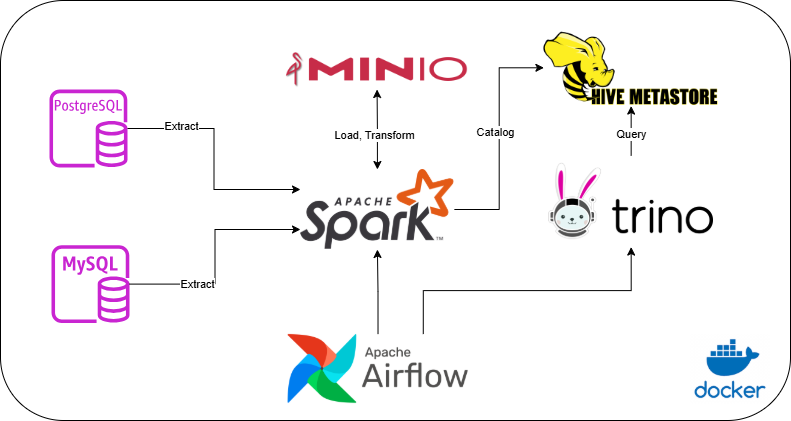

Local Data Lakehouse with Hive Table Format
===========================================

##Stack
- Apache Airflow: orchestrator
- Docker: containerization (creates all instances - containers)
- Postgres & MySQL: Operational Databases
- Apache Spark: data processing engine ( data transformation and catalog using pyspark jobs)
- Hive Metastore: repository of metadata for Hive tables
- Minio: Object Storage (data lake)
- Trino: Query engine

AWS Cloud Equivalence:
======================
- Apache Airflow --> Amazon Managed Workflows for Apache Airflow
- Apache Spark, Hive Metastore --> AWS Glue
- Minio --> AWS s3
- Trino --> AWS Athena